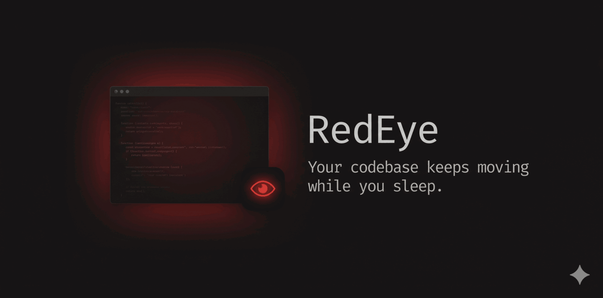

<div align="center">
  
  
  <p><sub><i>Demo: <code>/redeye:init</code> → <code>/redeye:start</code> → wake up to a working weather CLI. Real overnight run.</i></sub></p>
  <p>
    <a href="https://github.com/Bitmia-ai/RedEye/blob/main/LICENSE">
      
    </a>
    <a href="https://docs.anthropic.com/en/docs/claude-code">
      
    </a>
  </p>
</div>

---

## What is RedEye?

**RedEye works overnight.** Add tasks, run `/redeye:start`, walk away. Come back to tested, reviewed commits on a branch you approve before anything ships.

It's an opinionated Claude Code plugin that follows a strict development cycle: triage → plan → build → review → deploy → verify → merge. You define what to build — RedEye figures out how. No configuration after install. No setup decisions. No need to read the orchestration internals to use it.

You stay in control. Every task comes from your task list. Steer with `/redeye:steer "prioritize performance"`. When RedEye can't decide, it logs the question to your inbox (see `/redeye:status`), picks a safe default, and keeps moving — or parks the task and moves on. It never guesses. If a task fails review three times, it parks it. When the task list is empty, RedEye stops and waits for new tasks.

> [!NOTE]
> RedEye is a personal project maintained in spare time. It works, but updates are infrequent. Feedback and contributions welcome.

## Quick Start

### Prerequisites

- [Claude Code](https://docs.anthropic.com/en/docs/claude-code) with plugin support
- The [`ralph-loop`](https://github.com/anthropics/claude-plugins-official/tree/main/plugins/ralph-loop) plugin (provides the infinite-loop mechanism RedEye runs inside). Install it inside Claude Code with:
  ```
  /plugin marketplace add anthropics/claude-plugins-official
  /plugin install ralph-loop@claude-plugins-official
  ```
- `jq` (`brew install jq` / `apt-get install jq`)
- `git` 2.17 or newer

### Install

Inside Claude Code, add the marketplace and install:
```
/plugin marketplace add Bitmia-ai/RedEye
/plugin install redeye@bitmia-ai
```

For local development:
```bash
git clone https://github.com/Bitmia-ai/RedEye.git
cd /path/to/your-project       # NOT into RedEye itself — RedEye scaffolds .redeye/ into wherever you run /redeye:init
claude --plugin-dir /absolute/path/to/RedEye
```

### Use

```bash
/redeye:init                              # Scaffold control files in your project
/redeye:tasks dark mode would be nice     # Just say what you want
/redeye:tasks fix the Safari login bug    # RedEye expands it into a full entry
/redeye:start                             # Start working
```

You don't write specs. A sentence is enough — `/redeye:tasks` infers the type (feature / bug / security / test), a priority, and concrete details, then the PLAN phase writes the full spec. See [`examples/sample-tasks.md`](examples/sample-tasks.md).

Come back in the morning. Check what happened:

```bash
/redeye:status     # What's done, what's in progress
/redeye:log        # Iteration history
```

## How It Works

1. You add tasks with `/redeye:tasks` — as detailed or vague as you like
2. You run `/redeye:start` and walk away
3. RedEye picks the top item, plans it, builds it with TDD, reviews it, deploys it, verifies it, merges it
4. Picks the next item. Repeat.
5. Want to change direction? Use `/redeye:steer` — directives are picked up at the start of every iteration
6. Need your input? RedEye logs the question and decides: proceed with a sensible default, or block the task and move on. Run `/redeye:status` to see and answer pending questions
7. Task list empty? RedEye stops and waits for new tasks

One task at a time, start to finish. No half-finished work. **All changes are committed to git locally — RedEye never pushes to a remote.** You review and push when you're ready.

```
                         ┌─────────┐
                         │   CTO   │ orchestrator — reads digest, decides next phase
                         └────┬────┘                                  ┃ runs on main
                              │
              ┌───────────────┼───────────────┐
              │               │               │
        env broken?    answers in INBOX?   task list empty?
              │               │               │
         STABILIZE      INCORPORATE          STOP
      (fix broken env) (adjust defaults   (wait for tasks)
                        from your answers)
              │               │
              └───────┬───────┘
                      │
                 ┌────▼────┐
                 │ TRIAGE  │ pick top item                             ┃ main
                 └────┬────┘
                      │
                 ┌────▼────┐
                 │  PLAN   │ spec + test strategy per sub-task         ┃ main
                 └────┬────┘
                      │
              ╔═══════▼═══════════════════════════════════════════════╗
              ║  create worktree — .worktrees/T{id} on branch         ║
              ║  redeye/T{id}                                         ║
              ║                                                       ║
              ║    ┌─────────┐                                        ║
              ║    │  BUILD  │ TDD: write tests first → implement →   ║
              ║    │         │ tests pass. Adds E2E tests at the end. ║
              ║    └────┬────┘                                        ║
              ║         │    ▲                                        ║
              ║    ┌────▼────┤ (fails? retry)                         ║
              ║    │ REVIEW  │ max 3 cycles ── Documenter updates     ║
              ║    └────┬────┘                                        ║
              ║         │                                             ║
              ║    ┌────▼────┐                                        ║
              ║    │ DEPLOY  │ deploy + run regression (unit + int +  ║
              ║    │         │ smoke E2E; full E2E every 3rd deploy)  ║
              ║    └────┬────┘                                        ║
              ║         │                                             ║
              ║    ┌────▼────┐                                        ║
              ║    │ VERIFY  │ smoke tests + visual verification      ║
              ║    └────┬────┘                                        ║
              ╚═════════│═════════════════════════════════════════════╝
                        │           (user tester — persona-based
                        │            exploratory testing — runs
                        │            after each DEPLOY)
                        │                                       ┃ worktree
                   ┌────▼────┐
                   │  MERGE  │ worktree → main, delete worktree   ┃ main
                   └────┬────┘
                        │
                   back to CTO
```

## Testing

You can't ship code that hasn't been tested.

**Tests are written in BUILD — only in BUILD.** PLAN defines *what* to test (acceptance criteria and strategy per sub-task). BUILD writes the tests test-first (TDD), implements until they pass, then adds Playwright E2E tests for the task. Every subsequent phase only *runs* tests to gate progress:

| Phase  | What happens with tests |
|--------|-------------------------|
| PLAN   | Defines test strategy and acceptance criteria per sub-task in the spec |
| BUILD  | **Writes** unit + integration tests test-first (TDD), then implementation, then adds E2E tests |
| REVIEW | Checks test coverage and quality; Critical or Major findings block DEPLOY |
| DEPLOY | **Runs** regression suite (unit + integration + smoke E2E every deploy; full E2E every 3rd). Failure routes to STABILIZE instead of shipping |
| VERIFY | **Runs** smoke tests + visual verification via Playwright for UI changes |

**After DEPLOY**, a User Tester agent adopts a product persona and navigates the running app exploratorily. Bugs land in `.redeye/tester-reports.md`, product feedback in `.redeye/feedback.md`. TRIAGE picks up those bugs as new tasks on the next iteration.

If your project has no tests, RedEye will add them as it goes. You can also seed the task list with items like `/redeye:tasks add regression tests for checkout` and it will prioritize them.

## Safety

RedEye isolates its work in a [git worktree](https://git-scm.com/docs/git-worktree) — a separate working directory on its own branch. Your main branch is never modified during development. Changes only land on main after passing review, deployment, and verification gates. If something goes wrong, the worktree is discarded and main stays clean.

RedEye also:
- Creates `redeye/T{id}` branches for each task (deleted after merge)
- Adds `.worktrees/` to your `.gitignore` (one-time)
- Commits locally but **never pushes to a remote** — you review and push when ready

To disable worktree isolation (e.g., for shallow clones or repos with submodules), set `Enabled: false` under `## Worktree Isolation` in `.redeye/config.md`.

## Limitations

- **JS/TS bundlers without a directory-exclude API will explode.** RedEye creates per-task worktrees at `<project>/.worktrees/T<id>/` — full project-tree clones inside your project root. Bundlers that walk the project root (e.g., Next.js 16's default Turbopack) will index those clones recursively and the in-memory module graph balloons past 80 GB. If your project's dev server walks the root, mask `**/.worktrees/**` in its watcher config (webpack `watchOptions.ignored`, Vite `server.watch.ignored`) or run dev on a bundler that honors ignores. See `CLAUDE.md` for the full note.
- **Single-instance by default.** The `.active-claims.json` file is local — multiple RedEye instances on different machines will not coordinate without you adding a sync layer yourself.
- **macOS / Linux only.** Tested there; Windows is unsupported.
- **No remote pushes.** RedEye never pushes to a remote. Reviewing and pushing is your job.
- **Requires [`ralph-loop`](https://github.com/anthropics/claude-plugins-official/tree/main/plugins/ralph-loop).** RedEye is a wrapper around Anthropic's `ralph-loop` plugin — the persistent loop mechanism comes from there. Without `ralph-loop` installed, RedEye can't run.
- **Iterations can run 1–2 hours.** A complex task that chains BUILD → REVIEW → DEPLOY → VERIFY → MERGE in one Claude Code session may approach the per-session turn budget. Crash recovery resumes the phase on the next iteration, so no work is lost — but a single task occasionally ships across two sessions instead of one.

## Commands

| Command | What it does |
|---------|-------------|
| `/redeye:init` | Scaffold control files in your project |
| `/redeye:start` | Start (or resume) the dev loop |
| `/redeye:stop` | Stop after the current task finishes |
| `/redeye:status` | What's done, what's next, any questions |
| `/redeye:tasks` | View or add tasks |
| `/redeye:steer` | Give a directive ("focus on tests", "don't touch auth") |
| `/redeye:brainstorm` | Think through an idea, turn it into a task |
| `/redeye:log` | Recent iteration history |
| `/redeye:schedules` | Recurring tasks (e.g., "run security audit weekly") |
| `/redeye:pause` | Pause after the current task cycle |

## Control Files

RedEye reads and writes plain markdown files. No database, no dashboard required.

| File | What it's for |
|------|--------------|
| `.redeye/tasks.md` | Your task list. RedEye works top-down. |
| `.redeye/steering.md` | Tactical directives ("prioritize performance", "skip mobile for now") |
| `.redeye/inbox.md` | Questions RedEye has for you. Answer when you can; it moves on in the meantime. |
| `.redeye/status.md` | What RedEye is working on right now |
| `.redeye/config.md` | Project config — name, stack, deploy commands, vision |
| `.redeye/changelog.md` | What shipped |
| `.redeye/feedback.md` | RedEye's retros on its own work |

## How It's Different

RedEye is **opinionated, not flexible**. It doesn't give you knobs to configure every step. It has a fixed development methodology: TDD, code review before merge, regression tests before deploy. You can steer it with directives, but you can't skip the review phase or bypass tests.

This is intentional. An autonomous agent that cuts corners overnight is worse than none — you'd wake up to debug its shortcuts. RedEye won't.

**Compared to general-purpose coding agents:**
- They do what you tell them. RedEye works through a prioritized task list you define.
- They run a single prompt. RedEye runs a persistent loop with state between iterations.
- They stop at code generation. RedEye includes review, deploy, and verification gates before merging.

## FAQ

**Does it push to my repo?**
No. RedEye commits locally but never pushes to a remote. You review the changes and push when you're ready. It never force-pushes.

**What if I close my laptop or lose power?**
The loop stops. When you restart with `/redeye:start`, RedEye's crash recovery picks up where it left off: any in-progress phase is re-run from scratch, the worktree is reset if it had uncommitted changes, and the task is retried.

**What if it gets stuck?**
If a task fails review three times, RedEye parks it and moves on. You can also `/redeye:stop` at any time.

**Does it phone home?**
No. RedEye has no telemetry. It only talks to Anthropic's API through Claude Code (same as any other Claude Code session). No analytics, no crash reporting, no usage tracking.

**How much does it cost in tokens?**
Hard to predict — it depends on the size of your codebase, the complexity of each task, and which models the phase agents pick. RedEye is built to lean on Anthropic's prompt cache: the CTO reads a pre-computed digest instead of re-reading raw control files, every phase prompt is structured so its stable preamble can be cached, and lightweight phases run on smaller/cheaper models. We do our best to maximize cache hits, but token usage still scales with what your tasks actually demand. Watch the cost in your Anthropic usage dashboard for the first few iterations to calibrate.

**Can I use it on an existing project?**
Yes. `/redeye:init` in any git repo. It doesn't modify your code — just adds control files under `.redeye/`.

**Do I need to configure anything?**
No. `/redeye:init` sets sensible defaults for everything. You only need to write tasks.

## Roadmap

- **Control Tower** — web dashboard to manage RedEye across multiple projects from a browser. Start/stop sessions, view tasks/status/history, answer inbox questions, and steer.
- **Telegram integration** — manage everything from your phone. Check status, answer questions, steer, and add tasks without a terminal.

## Contributing

Contributions welcome. See [CONTRIBUTING.md](CONTRIBUTING.md). Please open an issue first for anything larger than a typo. Security issues: see [SECURITY.md](SECURITY.md).

## License

[MIT](LICENSE) — Copyright (c) 2026 Bitmia-ai
